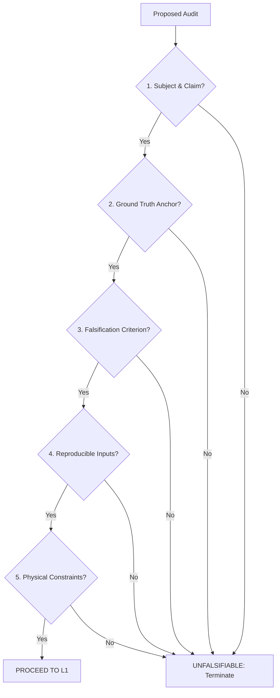

# P10 — Audit Feasibility Protocol
### Stage 0 / L0 Gatekeeper Checklist for Measured-System Claims

*Version: 1.0 (Draft)*  
*Author: Ivan Nestorov, VolMax Studio Lab*  
*Status: Open Doctrine / Core Gatekeeper*

---

## 1. Premise: The Feasibility Axiom

Before a single line of code is written, a dataset loaded, or a solver initialized, the verifier must answer one structural question: **Is this technical claim even capable of being audited?**

Most failed audits do not fail because of mathematical errors, but because they attempt to audit problems that are structurally **unfalsifiable**. In the VolMax P10 methodology, Stage 0 (L0) acts as the gatekeeper. If a claim fails the L0 feasibility checklist, the audit is terminated immediately before entering the computational phases (L1–L5). 

We do not audit to "discover" a model; we audit to verify a claim against a ground-truth anchor. Without an anchor and a clear falsification rule, the problem is not an audit — it is a synthesis or optimization exercise.

---

## 2. The L0 Checklist

A technical claim $C$ is deemed **auditable** under the P10 protocol if and only if it satisfies all five of the following criteria:



### 1. Subject & Claim ($S \rightarrow C$)
*   **Definition:** There must be a specific claimant $S$ (an asset owner, regulator, or research paper) making a concrete, checkable claim $C$ about a measured system.
*   **Failure Condition:** If there is no claimant making an explicit assertion, the task is a general analysis or research project, not an audit.

### 2. Ground Truth Anchor ($T$)
*   **Definition:** There must exist an independent, high-fidelity source of truth $T$ that is physically or statistically coupled to the claimed system (e.g., revenue-grade meters, independent grid operator SCADA, or public telemetry).
*   **Failure Condition:** If the ground truth is private, decommissioned, or aggregated such that individual unit performance is masked, the claim is not auditable.

### 3. Falsification Criterion ($E$)
*   **Definition:** There must be a predefined mathematical or physical threshold $E$ under which the claim $C$ is declared false.
*   **Failure Condition:** If the verification result can always be explained away by shifting parameters or if any arbitrary result is acceptable, no falsification criterion exists.

### 4. Reproducible Inputs ($I$)
*   **Definition:** The raw measurements and logs required to compute the verification metric must be publicly accessible and permanently pinned (e.g., via Zenodo DOI or hash-locked registry).
*   **Failure Condition:** If inputs cannot be verified or are subject to silent updates, downstream results are assertions, not findings.

### 5. Physical/System Constraints ($P$)
*   **Definition:** The system must be governed by well-defined, enforceable physical laws (e.g., conservation of energy, Kirchhoff's laws, thermodynamic degradation bounds) that limit the feasible solution space.
*   **Failure Condition:** If the mathematical model can violate physics without triggering a failure state, the verification has no physical foundation.

---

## 3. Verdict Mapping: Proceed or Terminate

At the end of the L0 assessment, the verifier issues a Stage 0 Verdict:

| Condition | Status | Action |
|---|---|---|
| All 5 checks **PASS** | **Feasibility Verified** | Proceed to **P10-L1 (Data Integrity)** |
| Any check **FAILS** | **Unfalsifiable-as-Stated** | **HALT AUDIT.** Issue Rejection Notice. |

> [!IMPORTANT]
> If the audit is halted at L0, no computational resources are spent on L1–L5. The report ends with a **Rejection Notice** detailing which criteria failed and why the claim cannot be falsified.

---

## 4. Retrospective Analysis: AEMO vs. RTE7000

To illustrate the necessity of the P10-L0 gatekeeper, we compare two recent cases in the VolMax portfolio:

### Case 1: AEMO BESS Dispatch Audit
*   **Claim ($C$):** Battery energy storage systems (BESS) conform to 5-minute dispatch instructions in the NEM.
*   **Ground Truth ($T$):** Publicly archived 4-second SCADA and 5-minute targets from AEMO.
*   **Falsification ($E$):** Maximum error exceedance bands (max(6 MW, 3% capacity)).
*   **Physical Constraints ($P$):** Power output must respect nameplate limits and bid parameters.
*   **L0 Status:** **PASS (Proceed to L1).** Resulted in a complete, reproducible audit report with a clear verdict.

### Case 2: RTE7000 French Grid Reconstruction (Unanchored)
*   **Claim ($C$):** Reconstructed nodal injections (generation/load) for 7,000 buses are physically and operationally accurate.
*   **Ground Truth ($T$):** None at node-level. RTE explicitly omits individual generation and load telemetry for privacy and security.
*   **Falsification ($E$):** None. Because the system is underdetermined, infinite combinations of nodal injections satisfy the network's power flow constraints.
*   **L0 Status:** **FAIL (Halted at L0).** 
    *   *Why:* The individual nodal injections are **unfalsifiable**.
    *   *Correction:* The task must be reclassified. It is either:
        1.  **Reclassified as Optimization/Synthesis (Non-Audit):** Extricated from the VolMax Audit brand.
        2.  **Anchored to Regional/Large-Unit actuals:** If we introduce éCO2mix (regional load/generation sums at 15-minute intervals) and ENTSO-E (large generation units $\ge 100\text{ MW}$ hourly actuals), we establish a **statistical anchor**. The reconstruction is only auditable to the extent that it conforms to these aggregates. Without these anchors, the audit cannot proceed.

---

## 5. Summary of Feasibility Checklist

```markdown
- [ ] 1. Subject & Claim: Who claims what?
- [ ] 2. Ground Truth Anchor: Where is the physical reference?
- [ ] 3. Falsification Criterion: When does the claim fail?
- [ ] 4. Reproducible Inputs: Can anyone download the exact dataset?
- [ ] 5. Physical Constraints: Does physics enforce a boundary?
```

*If any box is unchecked, the claim is unfalsifiable. The protocol halts.*
